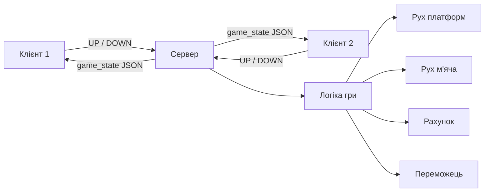

# Онлайн Пінг-Понг

> Це шаблон для створення власної онлайн-гри **Пінг-Понг** на двох гравців. Гра вже працює через локальну мережу — залишилось зробити її красивою! 

## 🔧 Що вже зроблено:

- ✅ Готовий сервер і клієнт (гравець)
- ✅ Фізика м’яча та платформи
- ✅ Перемога при рахунку 10
- ✅ Очікування другого гравця
- ✅ Події зіткнення (для звуків)

## Як запустити проєкт

1. **Завантаж проєкт**
   - Можеш клонувати або завантажити ZIP:
     ```
     git clone https://github.com/KravaAO/ping-pong.git
     ```

2. **Увімкни сервер**
   - Відкрий `server.py` і запусти його:
     ```
     python server.py
     ```

3. **Запусти клієнта (2 рази)**
   - Відкрий два вікна (на одному або різних комп’ютерах з допомогою викладача) і запусти `client.py`:
     ```
     python client.py
     ```

> ⚠️ Усі файли мають бути у тій самій папці. Сервер запускається **лише один раз**, а `client.py` — для кожного гравця.

## Як це працює?


> Сервер приймає двох гравців, обробляє їхні команди руху та керує всією логікою гри: рухом м’яча, зіткненнями, рахунком і переможцем. Клієнти лише надсилають натискання клавіш та відображають актуальний стан гри, який отримують від сервера у форматі JSON.

### Сервер (`server.py`)
- Очікує **двох гравців**
- Веде гру: рухає м’яч, перевіряє зіткнення, надсилає **стан гри**
- Приймає команди `UP`, `DOWN` від гравців

### Клієнт (`client.py`)
- Підключається до сервера 
- Відображає гру, платформи, м’яч, рахунок
- Відправляє натискання клавіш (`W` / `S`) на сервер


> 🏆 Найкреативніші проєкти отримують додаткові логіки!

Успіхів! Нехай твоя гра буде найкращою!
